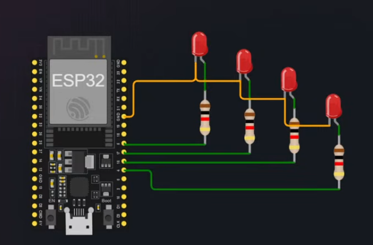

# ESP32 Blink - Learning Project

This is a small educational project for the [Embedded Development course](https://beetroot.academy/courses/online/kurs-embedded-development)

## Circuit Diagram

## Result Video

<video controls width="640">
  <source src="./video.mp4" type="video/mp4">
  Your browser does not support the video tag.
</video>

If the embedded player is not available in your viewer, open the video directly: [video.mp4](./video.mp4)
